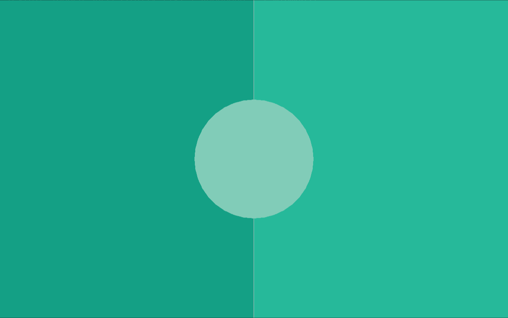

# Introduction to Raylib

Since the game relies on raylib, the first thing you need to do is install raylib on your system via your package manager of choice. Make sure that there exists a file like `/usr/include/raylib.h` after installation, it is needed.

## FIP setup

Before we can write any code for the game we need to set up FIP. So, we need to create a `.fip/config` directory and place the `fip.toml` and `fip-c.toml` files in it:

**`fip.toml`**:
```toml
[fip-c]
enable = true
```

**`fip-c.toml`**:
```toml
[raylib]
headers = ["/usr/include/raylib.h"]
```

That's it, we now are able to use the `raylib` library in Flint.

## Spawning a window

The first thing we will do is to spawn a raylib window. So, we will create two files in our source directory, `colors.ft` and `main.ft`. The `colors.ft` just contains a bunch of colors which will be needed throughout this journey of creating a small Pong program:

**`colors.ft`**:
```ft
use Fip.raylib as rl

const data Colors:
	rl.Color black = rl.Color(0, 0, 0, 255);
	rl.Color white = rl.Color(190, 190, 190, 255);
	rl.Color gray = rl.Color(100, 100, 100, 255);
	rl.Color green = rl.Color(38, 185, 154, 255);
	rl.Color dark_green = rl.Color(20, 160, 133, 255);
	rl.Color light_green = rl.Color(129, 204, 184, 255);
	rl.Color yellow = rl.Color(243, 213, 91, 255);
```

As you can see, the file just contains a bunch of const data expressions used later on. We do not need them *just yet* but we need it shortly. Lets not focus too much on that file, lets move on to the `main.ft` file instead:

**`main.ft`**:
```ft
use Fip.raylib as rl

def main():
	rl.InitWindow(1280, 800, "Pong");
	rl.CloseWindow();
```

As you can see, this is truly a small program, we just call the `InitWindow` and `CloseWindow` functions respectively. I like to give an import alias to auto-generated extern files files, in this case the alias `rl` for `raylib`. All functions and types coming from raylib will be prefixed with this alias. The parameters to the `InitWindow` function are the window width, the height and the name. You can always look up the signatures of any function or type in the auto-generated `.fip/generated/raylib.ft` file, in the case of `InitWindow` the definition looks like this:

```ft
extern def InitWindow(mut i32 width, mut i32 height, const str title);
```

We can compile the program using `flintc main.ft` but then we will get this error:

> ```
> ld.lld: error: undefined symbol: InitWindow
> >>> referenced by main.ft:4
> >>>               main.o:(_main)
>
> ld.lld: error: undefined symbol: CloseWindow
> >>> referenced by main.ft:5
> >>>               main.o:(_main)
> Linking failed with LLD
> ```

This is a linking error. The `main.o` object file expects the symbols `InitWindow` and `CloseWindow` to be linked to it. I will not go in depth into the topic of [linking](https://en.wikipedia.org/wiki/Linker_(computing)) here, feel free to read more about it. What you need to know is that we need to pass the `-lraylib` flag to the linker of the Flint compiler, which is `lld`. We pass flags to the linker using the `--flags="..."` command. So, to be able to compile this small program we need to compile it like this:

```sh
flintc main.ft --flags="-lraylib"
```

instead. If you try to execute the built `main` file now, you will see a window blinking for a split second and an output like

> ```
> INFO: Initializing raylib 6.0
> [A bunch of more infos...]
> INFO: Window closed successfully
> ```

being printed to the console. This means that everything works exactly as intended and raylib works!

## Game Loop

The next thing we need to make sure of is that the window does not immediately close after the program starts up. We do this by adding a [game loop](https://gameprogrammingpatterns.com/game-loop.html). The `main.ft` now looks like this after adding the game loop:

**`main.ft`**:
```ft
use Fip.raylib as rl

use "colors.ft"

def main():
	rl.InitWindow(1280, 800, "Pong");

	while not rl.WindowShouldClose():
		rl.BeginDrawing();
		rl.ClearBackground(Colors.dark_green);
		rl.EndDrawing();

	rl.CloseWindow();
```

As you can see, we now used our previously defined `colors.ft` file to get access to the `Colors.dark_green` color. The main game loop can immediately be spotted. The `while not rl.WindowShouldClose():` is pretty descriptive. While the window (the game) should not close, execute this loop. We can close the game manually by pressing `ESC` on the keyboard, this is a pre-set key by raylib which it understands as "okay, exit the game" by default.

In the loop body we do three things, first we tell raylib that we want to begin drawing to the window / the screen, then we tell it to clear the background with a given color and then we tell it to end drawing. I will not go deeply in-depth how raylib works under the hood, but this is how we draw things to the screen. You will see this pattern throughout the use of raylib, we do a `begin_xx` or `init_xx` (like init window) and later on a `end_xx` or `close_xx`. This pattern is very common with [immediate mode rendering](https://en.wikipedia.org/wiki/Immediate_mode_(computer_graphics)).

If you run the program, the window which is opened now should look like this:


## Resizing

Next up we make the window resizable. We do this by adding these two lines *before* initializing the window. That's pretty important to put these flags in front of it, as otherwise they are not applied when creating our window:

```ft
u32 flags = u32(rl.ConfigFlags.FLAG_WINDOW_RESIZABLE);
rl.SetConfigFlags(flags);
```

The `FLAG_WINDOW_RESIZABLE` is a [bitflag](https://developer.mozilla.org/en-US/docs/Glossary/Bitwise_flags) or also called bitwise flag. We can add multiple flags together before passing them to `SetConfigFlags`. As a matter of fact, lets add a second flag, enabling [VSync](https://en.wikipedia.org/wiki/Screen_tearing#Vertical_synchronization):

```ft
u32 flags = u32(rl.ConfigFlags.FLAG_WINDOW_RESIZABLE);
flags += u32(rl.ConfigFlags.FLAG_VSYNC_HINT);
rl.SetConfigFlags(flags);
```

Now the Pong game will always run at your screens refresh rate and not needlessly run at thousands of frames per second for no benefit. But now with these flags active, the game is resizable and is properly VSynced.

## drawing

Lets next start looking at drawing and how to draw objects to the screen. For this, we first need to find out the actual size of the screen at each iteration of our game loop, or otherwise our the game would not scale when resizing the game. For this, we add a local variable, `screen` to the file. We update the screen every iteration of the game loop by calling `GetScreenWidth` and `GetScreenHeight` respectively:

**`main.ft`**:
```ft
use Fip.raylib as rl

use "colors.ft"

def main():
	// Screen setup
	i32x2 screen = (1280, 800);
	u32 flags = u32(rl.ConfigFlags.FLAG_WINDOW_RESIZABLE);
	flags += u32(rl.ConfigFlags.FLAG_VSYNC_HINT);
	rl.SetConfigFlags(flags);
	rl.InitWindow(screen.x, screen.y, "Pong");

	while not rl.WindowShouldClose():
		screen = (rl.GetScreenWidth(), rl.GetScreenHeight());

		rl.BeginDrawing();
		rl.ClearBackground(Colors.dark_green);
		rl.EndDrawing();

	rl.CloseWindow();
```

The next step is to properly draw the game board. We already have our "dark" green background. The next thing we need to draw is the right half of the screen with a different color (`green`), draw a vertical (`white`) line in the middle of the screen and to draw the circle in the middle with the . For this, we use the `DrawRectanlge`, `DrawLine` and `DrawCircle` functions from raylib respectively:

```ft
extern def DrawRectangle(mut i32 posX, mut i32 posY, mut i32 width, mut i32 height, mut Color color);
extern def DrawLine(mut i32 startPosX, mut i32 startPosY, mut i32 endPosX, mut i32 endPosY, mut Color color);
extern def DrawCircle(mut i32 centerX, mut i32 centerY, mut f32 radius, mut Color color);
```

After clearing the background, and before ending our drawing, we now just need to insert the calls to these functions:

```ft
		rl.BeginDrawing();
		rl.ClearBackground(Colors.dark_green);

		// Overwrite right half of screen with green rectangle
		rl.DrawRectangle(screen.x / 2, 0, screen.x / 2, screen.y, Colors.green);
		// Draw vertical line in the middle of the screen
		rl.DrawLine(screen.x / 2, 0, screen.x / 2, screen.y, Colors.white);
		// Draw circle in the middle of the screen
		rl.DrawCircle(screen.x / 2, screen.y / 2, 150.0, Colors.light_green);

		rl.EndDrawing();
```

And now we should see the whole game board being drawed on screen:



You now know how to do basic drawing using raylib. So, let's get on to the next chapter, let's add a ball to our game field!
