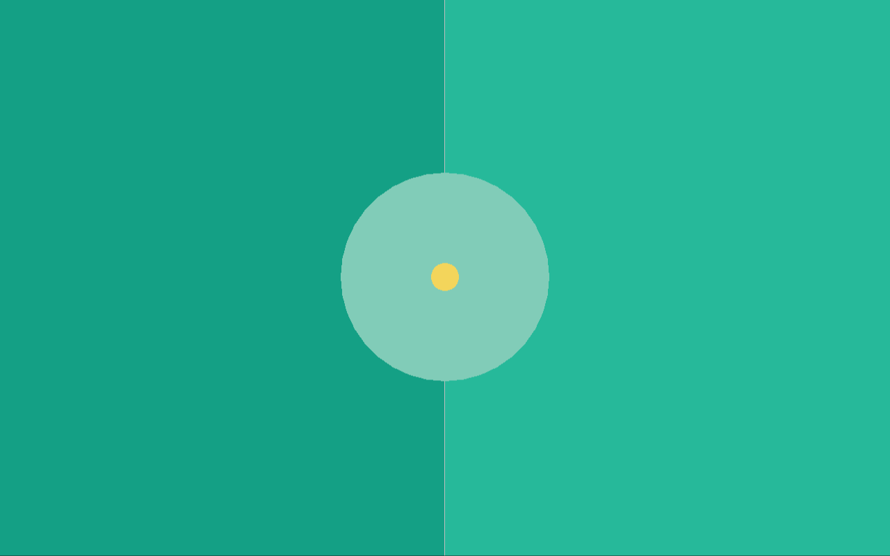
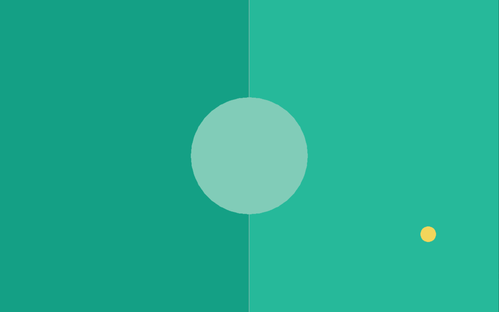

# The Ball

The next thing we want to add is the ball itself. It is added before any players because of the file dependencies, the ball is self-contained which makes it easy to implement first.

## A simple ball

We start by defining the data our ball will need. The ball moves in a given direction, which means it needs a `dir`ection, a `pos`ition, a `speed` and of course a `radius` too. So, we end up with this data structure for the ball:

**`ball.ft`**:
```ft
use Fip.raylib as rl

use "colors.ft"

data DBall:
	f32x2 pos = f32x2(0, 0);
	f32x2 dir = f32x2(0, 0);
	f32 speed = 0;
	f32 radius = 20;
	DBall(pos, dir, speed, radius);
```

We will not need a reusable `func` component for the ball here, as the balls functionality is not shared with any other object. So, we just define our `Ball` object with defined the functions directly in it. For now, we will just add one function to the `Ball` object: `draw`.

```ft
object Ball:
	data: DBall ball;
	Ball(ball);

	const def draw():
		rl.DrawCircle(i32(ball.pos.x), i32(ball.pos.y), ball.radius, Colors.yellow);
```

The balls color is yellow. As you can see, the position, direction and speed of the ball are all implemented as floating point values but the `DrawCircle` function expects values of type `i32` for the `x` and `y` position when rendering. It is generally recommended to store positions, directions etc always as floating point numbers, as in games we often do incremental changes (move a tiny bit) each frame, those incremental changes would get lost entirely when using integer values (as this "tiny bit" is almost always less than 1 but greater than 0).

## Creating and drawing

Now that we created the `ball.ft` file we want to create and render the ball in the game loop. So, we add the `use "ball.ft"` clausel to the main file and then we create the ball before entering the game loop:

```ft
	// Initialize game objects
	ball := Ball(DBall(f32x2(screen / 2), f32x2(1, 1), 100, 20));

	while not rl.WindowShouldClose():
		// ...

		// Draw the game objects
		ball.draw();

		rl.EndDrawing();
```

If you now compile and run the game, the ball will be drawn in the center of the game window.



If you resize the game, however, the ball does stay in the same absolute position offset to the top left corner of the screen. This is something we have not talked yet about, since we put everything at half the screen up until now. The position `(0, 0)` in raylib is the top left corner. Downwards means positive `y` and rightwards means positive `x`. So, if you want an object to move to the upper left, both directions need to be negative. This knowledge is very important for the next segment.

## Moving the ball

To be able to move the ball, we *need* to know how much time has passed since the last frame. We *could* just call the `GetFrameTime()` function from raylib, but I want to practically use the `time` Core module here to showcase the exact same thing. As a baseline, this is how the `main.ft` looks now:

**`main.ft`**:
```ft
use Fip.raylib as rl

use "colors.ft"
use "ball.ft"

def main():
	// Screen setup
	i32x2 screen = (1280, 800);
	u32 flags = u32(rl.ConfigFlags.FLAG_WINDOW_RESIZABLE);
	flags += u32(rl.ConfigFlags.FLAG_VSYNC_HINT);
	rl.SetConfigFlags(flags);
	rl.InitWindow(screen.x, screen.y, "Pong");

	// Initialize game objects
	ball := Ball(DBall(f32x2(screen / 2), f32x2(1, 1), 100, 20));

	while not rl.WindowShouldClose():
		screen = (rl.GetScreenWidth(), rl.GetScreenHeight());

		rl.BeginDrawing();

		// Draw the game board
		rl.ClearBackground(Colors.dark_green);
		rl.DrawRectangle(screen.x / 2, 0, screen.x / 2, screen.y, Colors.green);
		rl.DrawLine(screen.x / 2, 0, screen.x / 2, screen.y, Colors.white);
		rl.DrawCircle(screen.x / 2, screen.y / 2, 150.0, Colors.light_green);

		// Draw the game objects
		ball.draw();

		rl.EndDrawing();

	rl.CloseWindow();
```

The first thing we need to do is to add

```ft
use Core.time
```

at the very top to include the `time` Core module in the `main.ft` file. To calculate the time which passed between frames ([delta time](https://en.wikipedia.org/wiki/Delta_timing)) we just compare the `TimeStamp` of the last frame with the current new `TimeStamp` of this frame. So, we need to start by adding

```ft
	TimeStamp last_frame = now();
	while not rl.WindowShouldClose():
```

before the loop to keep track of the time stamp of the last frame. We do not get the last frame / current frame difference at the very top of the loop, we do it right in the middle, after drawing the game board itself but before drawing the game objects. So, before drawing the ball we need to add those lines right here:

```ft
		// Get the delta time
		TimeStamp current_frame = now();
		Duration frame_duration = duration(last_frame, current_frame);
		f32 delta = f32(as_unit(frame_duration, TimeUnit.S));
		last_frame = current_frame;
```

We get a time stamp (`now()`) to get the current absolute time. We then calculate the frame difference (`frame_duration`) as a difference between the two time stamps, and then use the `as_unit` function to give the time difference a unit, in our case the unit is `TimeUnit.S` for seconds. If the game runs at `60 FPS` for example, the `delta` will now have the value of `0.0166667` seconds or roughly `16.67` milliseconds. This is how we can get the delta time in the main loop.

The next thing which needs to be done is to add an `update` function to the `Ball` object like so:

```ft
	def update(f32 delta):
		ball.pos += ball.dir * (delta * ball.speed);
```

It is recommended to put all `const` functions (functions not mutating local state of the object / func component) at the top and mutable functions (no `const`) below them. This function is rather simple, we just incrementally update the ball position by adding its direction updated with its speed and the frame delta. This means that the ball will move `ball.speed` pixels in the direction of `ball.dir` per second. The "per second" part is the only reason why we need the `delta` in the first place.

Now that we have the `update` function on the ball, we can call it in the `main.ft` file:

```ft
		last_frame = current_frame;

		// Update game objects
		ball.update(delta);
```

We add this code after getting the `delta` (since we use it) but before calling `ball.draw()`. If you try to run this program, you will see that the ball moves to the bottom right, that's because the `dir` is set to be `f32x2(1, 1)` so it just moves to the bottom right with a speed of `100` pixels per second (actually `141` pixels per second because the direction is not normalized).

## Randomizing the ball direction

For now the ball will always fly to the bottom right. But the ball should either fly to the left or the right when spawning, with a randomized angle in each direction. For this, we will add a `reset` function to the ball which resets its position, direction, and speed.

```ft
	def reset():
		i32 angle_deg = rl.GetRandomValue(-40, 40);
		i32 left_or_right = rl.GetRandomValue(0, 1);
		angle_deg += 180 * left_or_right;
		const f32 pi = 3.141592;
		const f32 angle_rad = (f32(angle_deg) * pi) / 180.0;
		f32x2 ball_dir = (cos(angle_rad), sin(angle_rad));

		ball.speed = 400.0;
		ball.dir = ball_dir;
		ball.pos = f32x2(rl.GetScreenWidth() / 2, rl.GetScreenHeight() / 2);
```

Since we call mathematical functions here, we need to include the `Core.math` module at the very top to gain access to `cos` and `sin`. I will not explain the mathematics here. We get a random angle between `-40` and `40` degrees and randomly choose whether the ball will fly to the left or to the right and then we reset the ball to start at the middle of the screen and set the speed and direction to their respective default values.

This means that in the `main.ft` file, we now no longer need to "properly" initialize the ball at all, we can change the ball initialization line to these two lines instead:

```ft
	ball := Ball(DBall(_));
	ball.reset();
```

As you can see, the ball now flies in a random direction on program startup, but it just flies off the screen forever.

## Colliding with the walls

This system will be changed a bit in a later chapter when we implement a proper collision system, but for now it would be great if the ball would just bounce off all four edges of the screen. To accomplish this, we first need to add two more functions to the ball, `reflect_v` and `reflect_h`. The `reflect_v` reflects the direction vertically (when colliding with left or right) while the `reflect_h` reflects it horizontally (when colliding with top or bottom):

```ft
	def reflect_v():
		ball.dir = ball.dir * (-1.0, 1.0);

	def reflect_h():
		ball.dir = ball.dir * (1.0, -1.0);
```

These functions only flip the `x` or `y` axis respectively. Okay, with these functions now added, we only need to update the `update` function:

```ft
	def update(f32 delta):
		ball.pos += ball.dir * (delta * ball.speed);

		const bool bounce_top = ball.pos.y - ball.radius < 0 and ball.dir.y < 0;
		const bool bounce_bottom = ball.pos.y + ball.radius > f32(rl.GetScreenHeight()) and ball.dir.y > 0;
		const bool bounce_left = ball.pos.x - ball.radius < 0 and ball.dir.x < 0;
		const bool bounce_right = ball.pos.x + ball.radius > f32(rl.GetScreenWidth()) and ball.dir.x > 0;
		if bounce_top or bounce_bottom:
			self.reflect_h();
		if bounce_left or bounce_right:
			self.reflect_v();
```

and now, when you try to run the program, the ball collides with all four sides and bounces off within the screen. Also, if the ball goes off screen (for example when you resize it) it will always fly back into the screen. If we would remove the `and ball.dir.(x or y) (> or <) 0` checks then the ball would flip every single time `update` is called when it is outside the screen bounds, so it would "vibrate" at the same position outside the screen. But through this check we ensure that the ball always "comes back" to the visible screen area.


