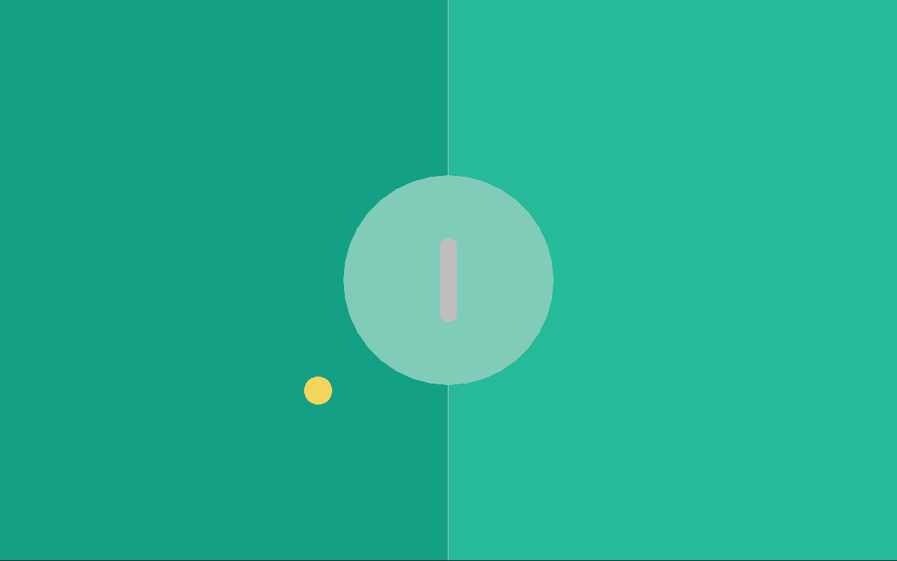

# Paddles

Next up we will finally work on the paddles themselves. Since we have two paddles, the `Cpu` and the `Player` paddle, which are kinda similar but a *bit* different, we *will* use a `func` component for this task, since the job of a func component is to provide reusable code which can be used across many objects. For now, we will still create a unified `Paddle` object, even though this object *will* be removed in the next chapter.

## A simple paddle

Okay, so lets start again by thinking what data the paddle even needs. It needs a `size` (x and y since it's a rectangle), a `pos`ition, and a `speed`, how fast the paddle can go. So, we end up with this data:

**`paddle.ft`**:
```ft
use Fip.raylib as rl

use "colors.ft"

data DPaddle:
	i32x2 size;
	f32x2 pos;
	f32 speed;
	DPaddle(size, pos, speed);
```

which we put into a new file, `paddle.ft`. We also know that we need a `draw` function to be able to draw the paddle to the screen. With this information we can now create the `func` component and the `object`. The `func` component will be called `FPaddleCommon` since it contains the common functionality both our paddles (`Cpu` and `Player`) will contain:

```ft
func FPaddleCommon requires(DPaddle paddle):
	const def draw():
		return;

object Paddle:
	data: DPaddle;
	func: FPaddleCommon;
	Paddle(DPaddle);
```

The next thing which needs to be done, now that the overall composition structure is up, is to implement the `draw` function:

```ft
	const def draw():
		i32x2 render_pos = i32x2(paddle.pos) - paddle.size / 2;
		rl.Rectangle rec = rl.Rectangle(render_pos.x, render_pos.y, paddle.size.x, paddle.size.y);
		rl.DrawRectangleRounded(rec, 0.8, 0, Colors.white);
```

The paddle position always points at the center of the paddle rectangle. So, to be able to draw the rectangle we need to know where the top left corner of the rectangle, the `render_pos`, is located at. To draw the rectangle we use the `DrawRectangleRounded` function from raylib:

```ft
extern def DrawRectangleRounded(mut Rectangle rec, mut f32 roundness, mut i32 segments, mut Color color);
```

Lets now add the paddle to the main file. We need to create a paddle together with the ball:

```ft
	ball := Ball(DBall(_));
	ball.reset();
	paddle := Paddle(DPaddle(_, f32x2(screen / 2), _));
```

And then draw it in the game loop:

```ft
		// Draw the game objects
		ball.draw();
		paddle.draw();
```

And now the paddle is drawn in the center of the game board:



## Moving the paddle

The next step is to make the paddle movable through keyboard presses. For now we just want to move the paddle up and down respectively. A very easy way to do this is to just add an `update` function to the paddle:

```ft
	def update(f32 delta):
		if rl.IsKeyDown(i32(rl.KeyboardKey.KEY_UP)):
			paddle.pos = paddle.pos - (0.0, paddle.speed * delta);
		if rl.IsKeyDown(i32(rl.KeyboardKey.KEY_DOWN)):
			paddle.pos = paddle.pos + (0.0, paddle.speed * delta);
```

We use the `IsKeyDown` function of raylib here which actually would expect the `KeyboardKey` enum but as C libraries often do, it is written to expect an `i32` instead (there is not much Fip can do here) so that's why we need to cast the enum value to an `i32` value before passing it to the function.

```ft
extern def IsKeyDown(mut i32 key) -> bool;
```

And in the `main.ft` file in the game loop we just call the `update` function every frame:

```ft
		// Update game objects
		ball.update(delta);
		paddle.update(delta);
```

and now the paddle can move up and down using the up and down arrow keys of the keyboard! But we have a problem: we can move the paddle fully outside the screen, we don't want that to happen!

## Clamping the paddle position

Clamping the paddle position to the screen bounds is pretty straight forward to do. Its nothing more than one single function, `clamp_position` which needs to be added:

```ft
	def clamp_position():
		const f32 border_distance = 10.0;
		const f32 min_y = f32(paddle.size.y / 2) + border_distance;
		const f32 max_y = f32(rl.GetScreenHeight() - paddle.size.y / 2) - border_distance;

		if paddle.pos.y < min_y:
			paddle.pos.y = min_y;
		else if paddle.pos.y > max_y:
			paddle.pos.y = max_y;
```

The function is pretty simple, we just check whether the `y` position is larger or smaller than our max or min values and clamp it to the respective max / min values.

Now, we just need to call the `clamp_position` in the `update` function:

```ft
	def update(f32 delta):
		// ...
		FPaddleCommon.clamp_position(paddle);
```

at the very end of the function and now we successfully added position clamping to the paddle.
