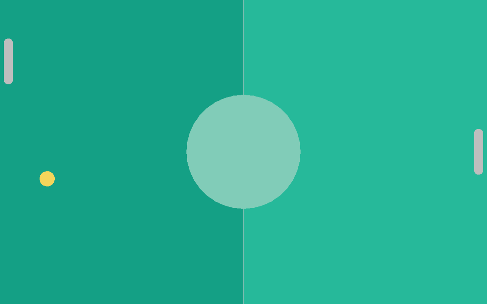

# Player and CPU

Next up we need to properly separate the paddle out into two different kinds of paddles, the `Player` and the `Cpu`. We will start with the `Player`, since the paddle we already have is most similar to it.

## Player

First we will create a new `player.ft` file which will contain all the player-specific code. We essentially move the `Paddle` object definition to the `player.ft` file and rename it to `Player` and then we also move the `update` function from `FPaddleCommon` to the `Player` object:

**`player.ft`**:
```ft
use Fip.raylib as rl

use "paddle.ft"

entity Paddle:
	data: DPaddle paddle;
	func: FPaddleCommon;
	Paddle(paddle);

	def update(f32 delta):
		if rl.IsKeyDown(i32(rl.KeyboardKey.KEY_UP)):
			paddle.pos = paddle.pos - (0.0, paddle.speed * delta);
		if rl.IsKeyDown(i32(rl.KeyboardKey.KEY_DOWN)):
			paddle.pos = paddle.pos + (0.0, paddle.speed * delta);
		self.clamp_position();
```

As you can see, we did not just copy-paste it, we added the `paddle` name for the `DPaddle` data and changed `FPaddleCommon.clamp_position(paddle)` to `self.clamp_position()` since all object functions have an implicit `self` parameter. It is not mandatory to change it, but it just looks cleaner this way.

And then in the main file we add the `use "player.ft"` clausel and instead of creating a `paddle := Paddle` we create a `player := Player` and rename all occurrences of `paddle` to `player`.

This all should have made absolutely zero difference to the program behaviour, but that was just the base work. We now can add player-specific functionality. For example, the `reset` function to make sure that the player is not spawned in the middle of the field but on the left side of the field instead:

```ft
	def reset():
		paddle.pos = f32x2(10 + paddle.size.x / 2, rl.GetScreenHeight() / 2);
```

and we call it in the `main` function right after creating the player, just like we did with the ball:

```ft
	// Initialize game objects
	ball := Ball(DBall(_));
	ball.reset();
	player := Player(DPaddle(_));
	player.reset();
```

As you can see, the player now is located at the left side of the screen, where it belongs.

## Cpu

Now that the player is at the left side of the screen, we can look at implementing the `Cpu` object. For this, we create yet another file, `cpu.ft` with this content:

**`cpu.ft`**:
```ft
use Fip.raylib as rl

use "paddle.ft"

object Cpu:
	data: DPaddle paddle;
	func: FPaddleCommon;
	Cpu(paddle);

	def update(f32 ball_y, f32 delta):
		// TODO follow ball
		return;

	def reset():
		paddle.pos = f32x2(rl.GetScreenWidth() - paddle.size.x / 2 - 10, rl.GetScreenHeight() / 2);
```

Next up lets add the `use "cpu.ft"` clausel to the main function and then initialize, reset, update and draw the cpu in the main file:

```ft
	cpu := Cpu(DPaddle(_));
	cpu.reset();
	// ...
	while not rl.WindowShouldClose():
		// ...
		cpu.update(ball.get_y(), delta);
		// ...
		cpu.draw();
```

And now we should see the cpu paddle being drawn at the right side of the game board. However, the ball does not collide with it nor does the cpu paddle try to follow the ball either.



## Cpu behaviour

Lets implement the `update` function of the cpu next:

```ft
	def update(f32 ball_y, f32 delta):
		if paddle.pos.y - 10.0 > ball_y:
			paddle.pos.y -= paddle.speed * delta;
		else if paddle.pos.y + 10.0 < ball_y:
			paddle.pos.y += paddle.speed * delta;
		self.clamp_position();
```

So now you will see that the cpu follows the ball, but the ball does not collide with the cpu paddle yet. For this to work we need to update the `check_collisions` function in the `collisions.ft` file from:

```ft
def check_collisions(mut Ball ball, FPaddleCommon paddle):
	if paddle.collides_with(ball):
		print("Collided with paddle!\n");
		ball.reflect_v();
```

to

```ft
def check_collisions(mut Ball ball, FPaddleCommon player, FPaddleCommon cpu):
	if player.collides_with(ball):
		print("Collided with player!\n");
		ball.reflect_v();

	if cpu.collides_with(ball):
		print("Collided with cpu!\n");
		ball.reflect_v();
```

and of course also update the `check_collision` call in the main function:

```ft
		// Check for collisions
		check_collisions(ball, player, cpu);
```

And now the ball collides with both the player and the cpu properly.
