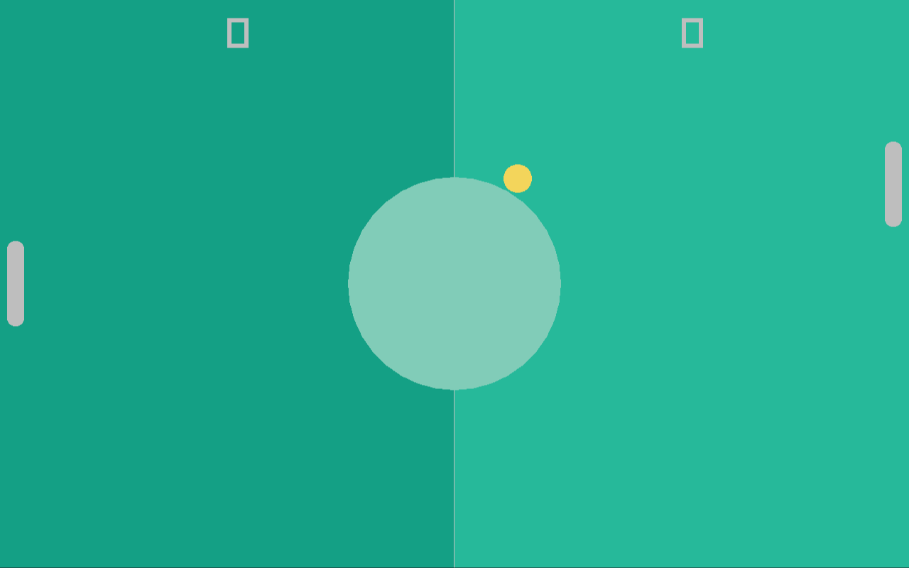
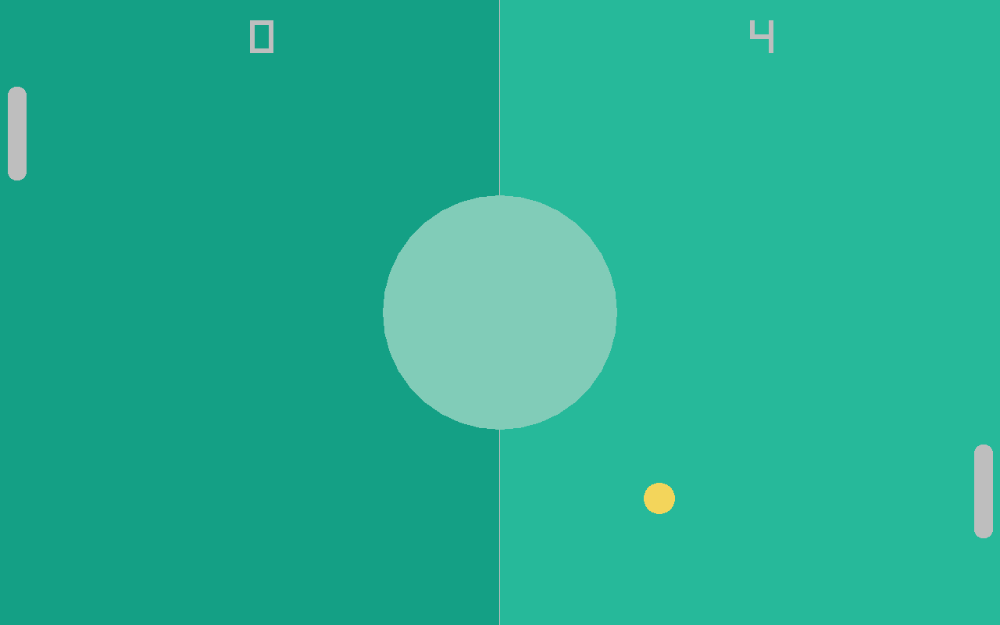

# Scoring System

Currently the ball is able to collide with the left and right side of the screen with no consequences. In pong the player or the cpu each get a point when the ball flies past the player or cpu respectively.

## UI

The first thing we will start on is to add UI to the game, it's just a number at the top of each game-board half describing how many points each player respectively has. For this, we add the `player_score` and `cpu_score` variables to the main function:

```ft
	u32 player_score = 0;
	u32 cpu_score = 0;
	TimeStamp last_frame = now();
	while not rl.WindowShouldClose():
		// ...
```

We draw these numbers using the `DrawText` function of raylib

```ft
extern def DrawText(const str text, mut i32 posX, mut i32 posY, mut i32 fontSize, mut Color color);
```

by just adding two calls to `DrawText` before calling `EndDrawing` at the end of the game loop:

```ft
		// Draw UI
		rl.DrawText(str(player_score), screen.x / 4, 20, 60, Colors.white);
		rl.DrawText(str(cpu_score), (screen.x * 3) / 4, 20, 60, Colors.white);
		rl.EndDrawing();
```

The UI is drawn at the very end so that the ball flies "behind" it. With this simple change, we now have two labels telling us the scores of each player.



## GameState

The next thing we add is a `GameState` enum to the `collisions.ft` file, and we change the `check_collisions` function to return a given game state, based on certain events (like a player scoring a value):

**`collisions.ft`**:
```ft
use Core.print

use "ball.ft"
use "paddle.ft"

enum GameState:
	RUNNING, P1_WON, P2_WON;

def check_collisions(mut Ball ball, FPaddleCommon player, FPaddleCommon cpu) -> GameState:
	if player.collides_with(ball):
		print("Collided with player!\n");
		ball.reflect_v();

	if cpu.collides_with(ball):
		print("Collided with cpu!\n");
		ball.reflect_v();

	return GameState.RUNNING;
```

We do not change the `main` function yet, as we first need to properly return `P1_WON` and `P2_WON`, but for that we need a way to check whether the ball has passed the paddle. Since the actual behaviour is different for both paddles but it's a common paddle behaviour, we add just the function declaration to the `FPaddleCommon` func module:

```ft
func FPaddleCommon requires(DPaddle paddle):
	const def ball_passed(Ball ball) -> bool;
```

Since the function is virtual (no body) we need to `link` the function declaration to a proper function definition in both the `Player` and `Cpu` entities:

```ft
entity Player:
	data: DPaddle paddle;
	func: FPaddleCommon;
	link: FPaddleCommon::ball_passed -> Player::ball_passed;
	Player(paddle);

	const def ball_passed(Ball ball) -> bool:
		return false;

	// ...
```

and

```ft
entity Cpu:
	data: DPaddle paddle;
	func: FPaddleCommon;
	link: FPaddleCommon::ball_passed -> Cpu::ball_passed;
	Cpu(paddle);

	const def ball_passed(Ball ball) -> bool:
		return false;
	
	// ...
```

And now that both the `Player` and `Cpu` both implement the function, we can call it in the `check_collisions` function:

```ft
def check_collisions(mut Ball ball, FPaddleCommon player, FPaddleCommon cpu) -> GameState:
	// Check if the ball passed one of the players
	if cpu.ball_passed(ball):
		return GameState.P1_WON;
	if player.ball_passed(ball):
		return GameState.P2_WON;

	// ...
```

and to now complete this feature addition, we need to check the return value of the `check_collisions` call in the main function:

```ft
		// Check for collisions
		switch check_collisions(ball, player, cpu):
			RUNNING:
				break;
			P1_WON:
				player_score++;
			P2_WON:
				cpu_score++;
```

The scores will not change yet because the `ball_passed` functions always return `false`, so we need to implement them. They aren't that hard, for the `Player` it's implementation is

```ft
	const def ball_passed(Ball ball) -> bool:
		return ball.get_x() + ball.get_radius() > paddle.pos.x;
```

and for the `Cpu` it's

```ft
	const def ball_passed(Ball ball) -> bool:
		return ball.get_x() - ball.get_radius() < paddle.pos.x;
```

As you can see, the `player_score++;` is executed a bunch of times when the score is increased. This is because when a score is made, all game object should be reset to their starting positions.

For this we add a small helper function to the `main.ft` file:

```ft
def reset_objects(mut Ball ball, mut Player player, mut Cpu cpu):
	ball.reset();
	player.reset();
	cpu.reset();
```

and then we just call it directly after creating the three objects and in the respective switch branches `P1_WON` and `P2_WON`.



We need to do one small change though to the `ball.ft` file, the `bounce_left` and `bounce_right` case is no longer needed. It can be removed entirely from the `update` function:

```ft
	def update(f32 delta):
		ball.pos += ball.dir * (delta * ball.speed);
		const bool bounce_top = ball.pos.y - ball.radius < 0 and ball.dir.y < 0;
		const bool bounce_bottom = ball.pos.y + ball.radius > f32(rl.GetScreenHeight()) and ball.dir.y > 0;
		if bounce_top or bounce_bottom:
			self.reflect_h();
```

With this up and running, the game is not far from finished. Next up we will add very simple sound-effects to the game.
